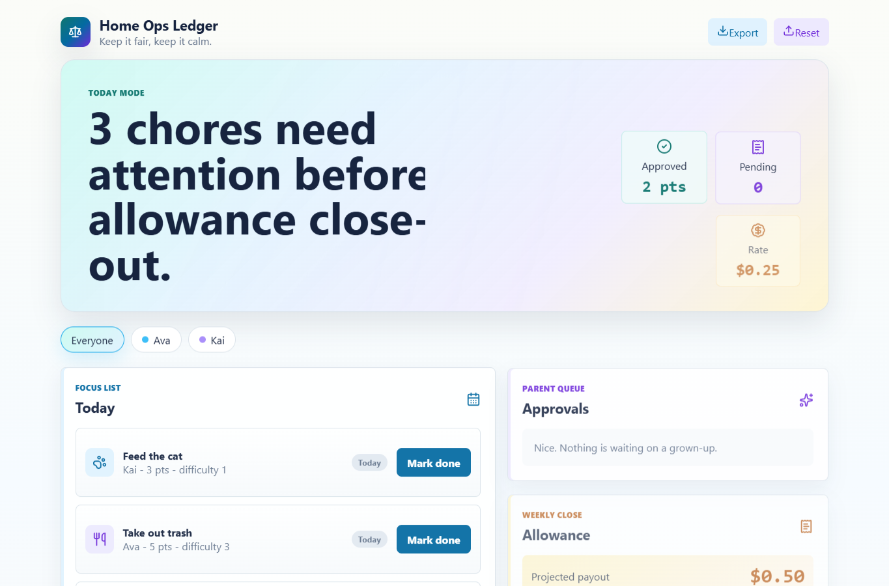

# Chore Allowance Ledger

[](https://github.com/Ramenagii/chore-allowance-ledger/actions/workflows/ci.yml)

A local-first family chore dashboard with a chore chart, allowance ledger, reward store, coupon printing, and a fairness view.



## Features

- Seeded demo family with Ava and Kai
- Today mode with kid filters, due badges, and big check-off buttons
- Parent approval queue for chores that need sign-off
- Allowance ledger with point and payout totals
- Reward store with redeemable coupons and print styling
- Fairness chart with a swap suggestion
- Local storage persistence with JSON export and demo reset

## Run Locally

```bash
npm install
npm run dev
```

## Build

```bash
npm run build
```

## Quality Gate

GitHub Actions runs install, audit, tests, and production build checks on pushes and pull requests.

The app keeps data in the browser via `localStorage`, so no accounts, backend, or cloud database are required for the demo.
